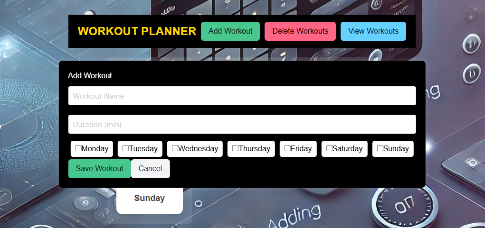

# Workout Planner

A single-page workout planner built using React.js. This application allows users to add, view, and delete workouts based on selected weekdays.

## User Story:
Create a space for the user to manage, track, and update their workout schedule for the week. The application allows the user to add descriptions for the workout as well as delete workouts as well.   (view)
We were motivated to develop this app as January is the universal month for new goals, especially fitness goals. We hope this application will aid the user in their ability to stick with their goals and create a healthy lifestyle. 

## Features

- **Add Workouts:** Users can input a workout name, select days to perform the workout, and specify duration.

- **View Workouts:** A chart displays all saved workouts, including assigned days and durations.

- **Delete Workouts:** Users can manually select and delete specific workouts instead of clearing all at once.

- **Responsive Design:** Styled using Bulma CSS for a clean and modern interface.

## Deployed website
https://workoutplannerro.netlify.app/

## Presentation:
https://docs.google.com/presentation/d/1Rop-qpb9Kv6YOsnqQhBW_J-k5m09hbLUrH1pGtYLzgk/edit#slide=id.p

## Contributors:
Oscar (https://github.com/gggrouchy) and Ryan (https://github.com/Kurt1717)
  
## Future Enhancements: 
-Add a backend with MongoDB to store workouts persistently.
-Implement authentication for personalized workout plans.
-dd progress tracking with workout history and statistics.

## License
MIT License
